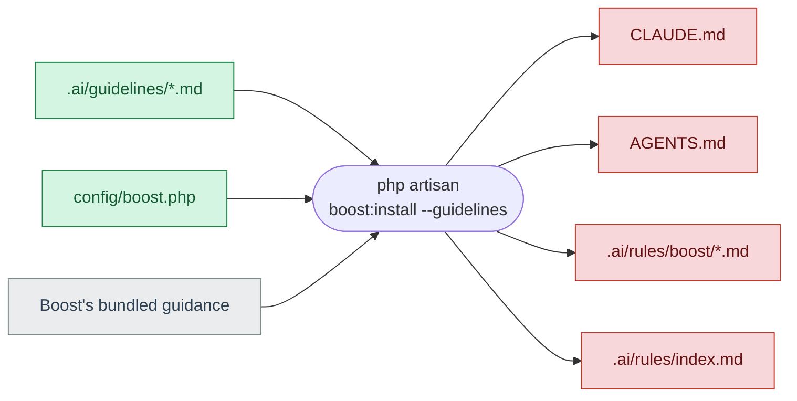
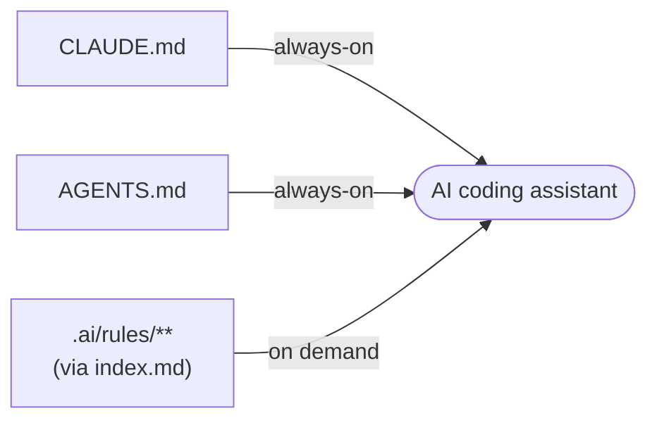

# AI Coding-Assistant Guidance (`.ai/`)

This repository ships guidance for AI coding assistants, managed by
[Laravel Boost](https://laravel.com/docs/13.x/boost). It comes in two layers.

- **Always-on guidance** — composed into `CLAUDE.md` and `AGENTS.md` at the repository root.
  "Always-on" means it is injected into the assistant's context on *every* request, regardless of
  which file you are working on. Source lives in [`.ai/guidelines/`](guidelines).
- **Path-scoped rules** — smaller, focused rules in [`.ai/rules/`](rules) that an assistant loads
  **on demand**, only when you edit a file whose path matches the rule. The map from paths to rule
  files is [`.ai/rules/index.md`](rules/index.md).

Because `CLAUDE.md` and `AGENTS.md` are committed, contributors get this guidance even without
running Boost themselves.

## How it fits together

Two separate things happen at two separate times.

### 1. Regenerating the files — `php artisan boost:install --guidelines`

Boost combines the sources you edit with its own bundled guidance to (re)generate the committed files:

**Green** = you edit these. **Red** = generated, never hand-edit (see below). **Grey** = Boost's own
guidance, shipped inside the package.

Path-scoped rules that we author (`.ai/rules/*.md`) are written by the `record-rule` tool, which also
updates `.ai/rules/index.md` — see [How to change the guidance](#how-to-change-the-guidance).

### 2. What a coding assistant loads

*Always-on* files load on every request; *on-demand* rules load only when you edit a file whose
path matches them.

## What is generated — never hand-edit

Boost regenerates these, so hand edits are overwritten on the next run:

- `CLAUDE.md` and `AGENTS.md` (repository root)
- `.ai/rules/index.md`
- `.ai/rules/boost/*.md` — Boost's own bundled framework and package guidance, not guidance we author.

Edit the **sources** instead, then regenerate.

## How to change the guidance

**Change always-on guidance** (something every session should know — architecture, conventions):

1. Edit the relevant file in [`.ai/guidelines/`](guidelines).
2. Regenerate: `php artisan boost:install --guidelines`
3. Commit the regenerated `CLAUDE.md` and `AGENTS.md` alongside your source edit.

**Add a path-scoped rule** (advice that only matters for a certain area of the code):

Rules are generated by Boost's `record-rule` tool, not written by hand. Ask your AI assistant to
call `record-rule` and describe the rule: the area it applies to (a path glob such as
`app/Http/Controllers/**`), a short title, and a few lines of guidance. Boost writes the rule into
the matching `.ai/rules/<area>.md` file and regenerates `index.md` for you. Don't create or edit
these rule files by hand.

## Configuration (`config/boost.php`)

This file is committed so everyone regenerates byte-identical output (no diff churn between
contributors). Two settings shape the composed files:

- `rules.scoped_guidelines` — when `true`, `@scoped([...])` blocks are pulled out of the
  always-on files and written to `.ai/rules/boost/`, so they load only for matching paths.
- `guidelines.exclude` — drops named guideline blocks from the composition entirely.

## Learn more

See the [Laravel Boost documentation](https://laravel.com/docs/13.x/boost).
